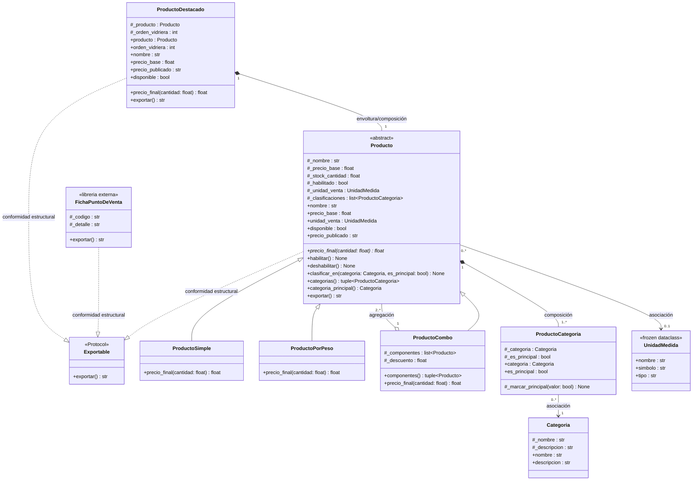

```mermaid
classDiagram
    class Exportable {
        <<Protocol>>
        +exportar() str
    }

    class Producto {
        <<abstract>>
        #_nombre : str
        #_precio_base : float
        #_stock_cantidad : float
        #_habilitado : bool
        #_unidad_venta : UnidadMedida
        #_clasificaciones : list~ProductoCategoria~
        +nombre : str
        +precio_base : float
        +unidad_venta : UnidadMedida
        +disponible : bool
        +precio_publicado : str
        +precio_final(cantidad: float)* float
        +habilitar() None
        +deshabilitar() None
        +clasificar_en(categoria: Categoria, es_principal: bool) None
        +categorias() tuple~ProductoCategoria~
        +categoria_principal() Categoria
        +exportar() str
    }

    class ProductoSimple {
        +precio_final(cantidad: float) float
    }

    class ProductoPorPeso {
        +precio_final(cantidad: float) float
    }

    class ProductoCombo {
        #_componentes : list~Producto~
        #_descuento : float
        +componentes() tuple~Producto~
        +precio_final(cantidad: float) float
    }

    class ProductoDestacado {
        #_producto : Producto
        #_orden_vidriera : int
        +producto : Producto
        +orden_vidriera : int
        +nombre : str
        +precio_base : float
        +precio_publicado : str
        +disponible : bool
        +precio_final(cantidad: float) float
        +exportar() str
    }

    class ProductoCategoria {
        #_categoria : Categoria
        #_es_principal : bool
        +categoria : Categoria
        +es_principal : bool
        #_marcar_principal(valor: bool) None
    }

    class Categoria {
        #_nombre : str
        #_descripcion : str
        +nombre : str
        +descripcion : str
    }

    class UnidadMedida {
        <<frozen dataclass>>
        +nombre : str
        +simbolo : str
        +tipo : str
    }

    class FichaPuntoDeVenta {
        <<libreria externa>>
        #_codigo : str
        #_detalle : str
        +exportar() str
    }

    Producto <|-- ProductoSimple
    Producto <|-- ProductoPorPeso
    Producto <|-- ProductoCombo

    Producto "1" *-- "1..*" ProductoCategoria : composición
    ProductoCombo "1" o-- "2..*" Producto : agregación
    Producto "0..*" --> "0..1" UnidadMedida : asociación
    ProductoCategoria "0..*" --> "1" Categoria : asociación

    ProductoDestacado "1" *-- "1" Producto : envoltura/composición

    Producto ..|> Exportable : conformidad estructural
    FichaPuntoDeVenta ..|> Exportable : conformidad estructural
    ProductoDestacado ..|> Exportable : conformidad estructural
```